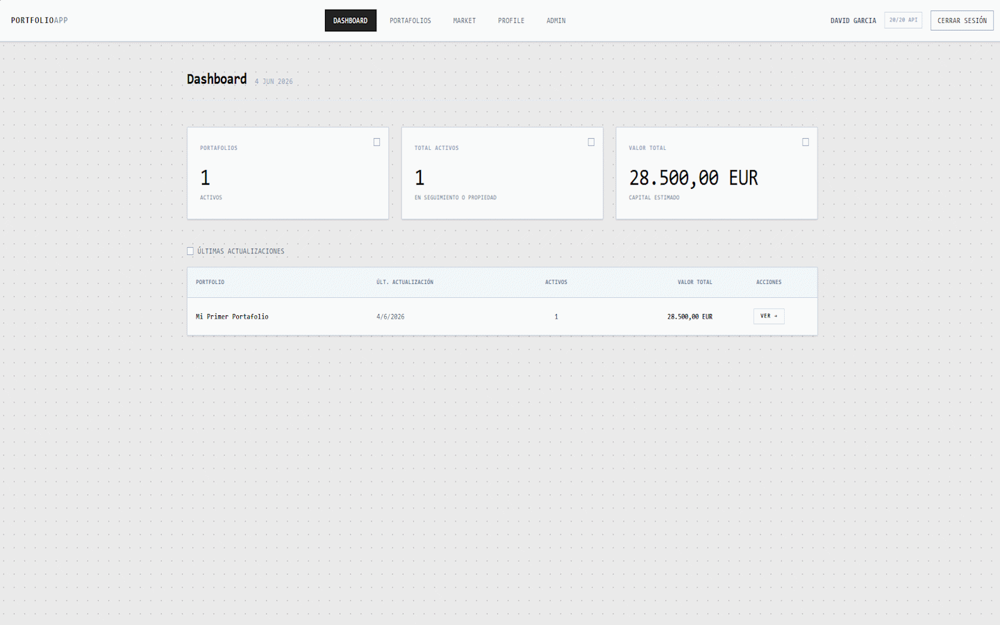
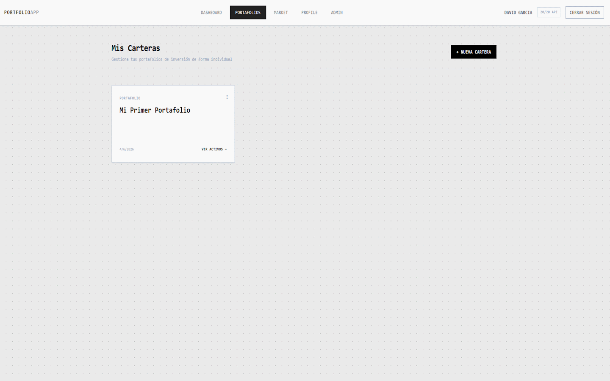
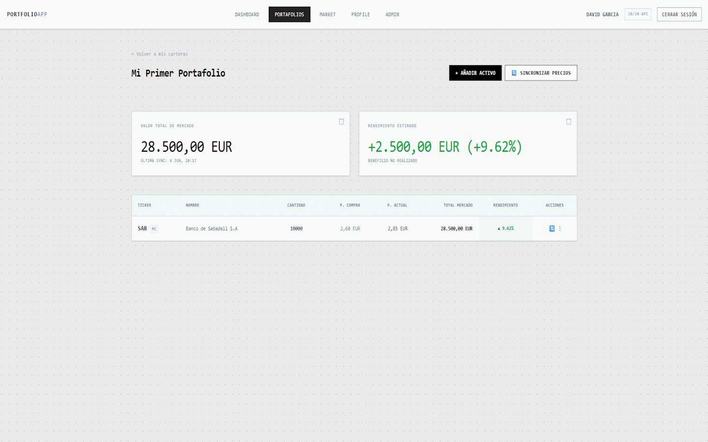
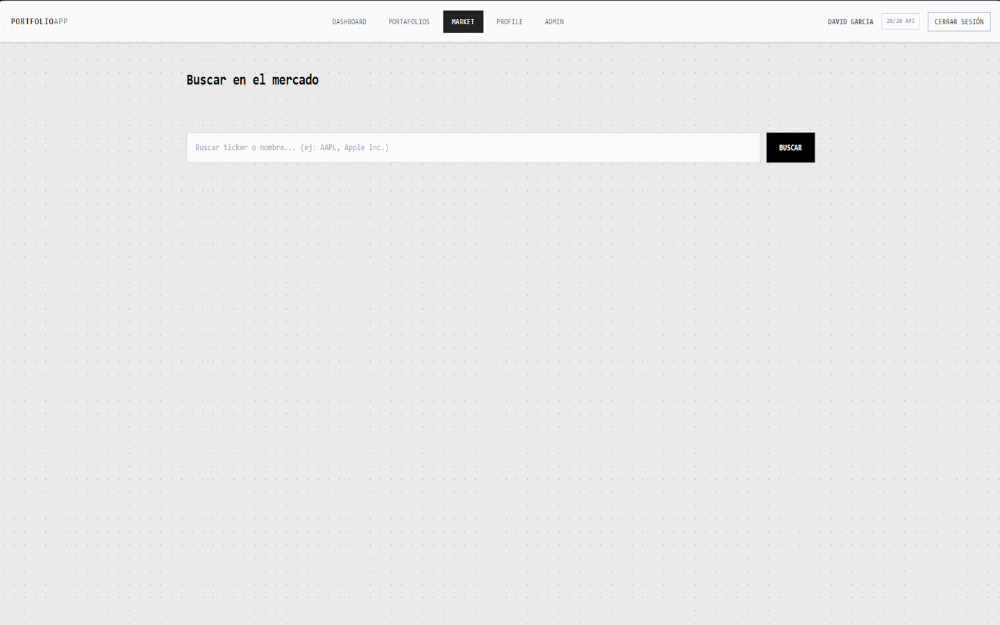
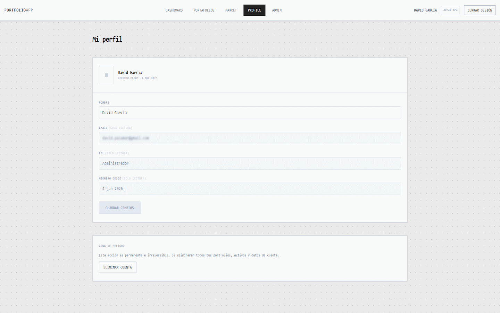
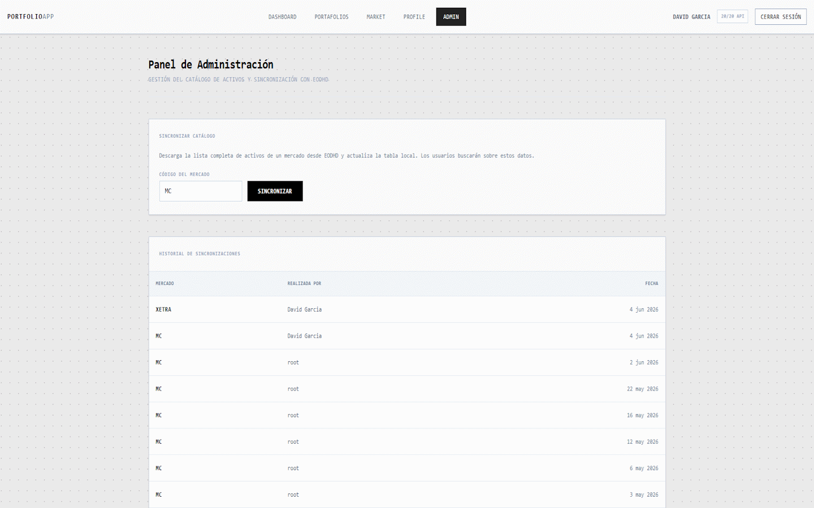
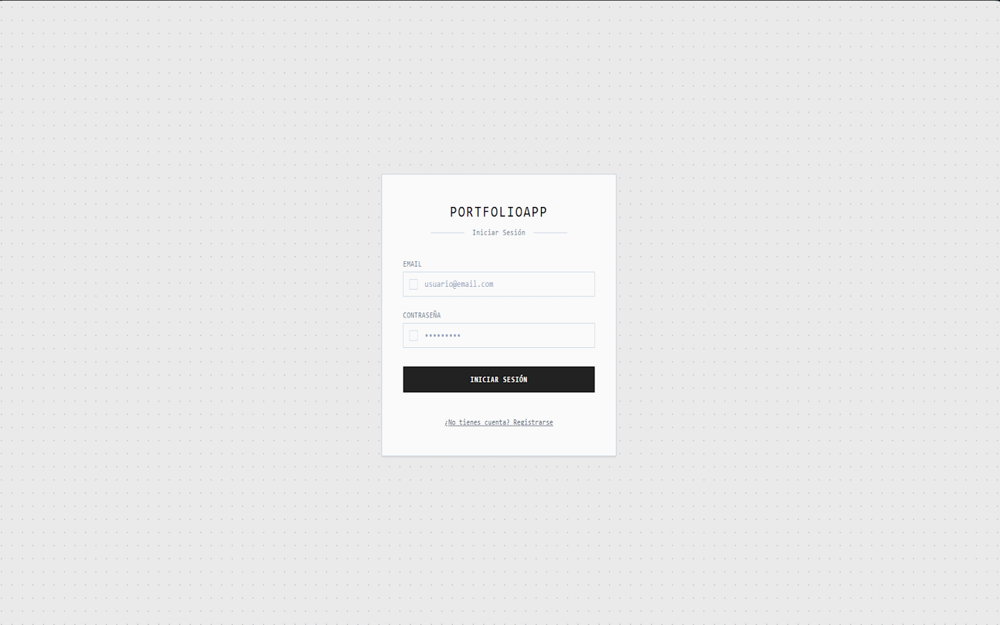
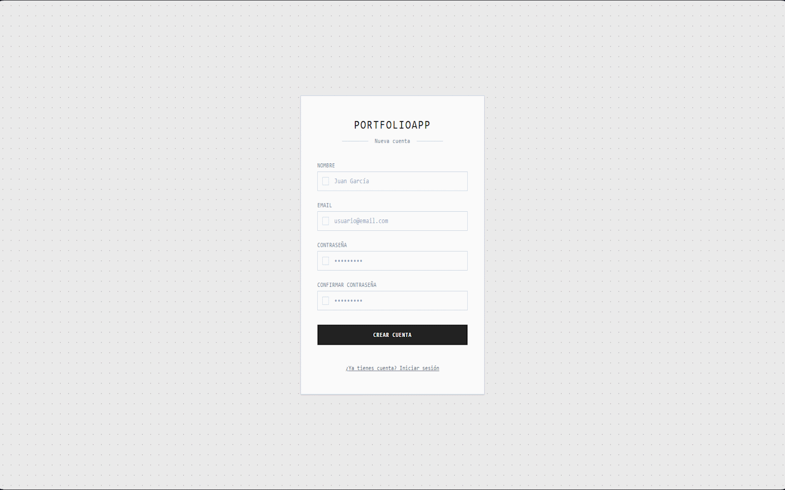

# PortfolioApp

Aplicación web para la gestión y seguimiento de carteras de inversión. Permite crear múltiples portafolios, añadir activos financieros desde mercados reales, sincronizar precios en tiempo real y visualizar métricas clave de rendimiento.

Construida con **React 19**, **Vite**, **Tailwind CSS v4** y **Supabase** como backend (Auth + PostgreSQL + Edge Functions). Los datos de mercado se obtienen en tiempo real a través de la API de [EODHD](https://eodhd.com/).

Proyecto desarrollado como parte de la asignatura de 2º DAM (Desarrollo de Aplicaciones Multiplataforma) en el **IES El Rincón**, bajo la tutorización del profesor **Guillermo Mauro Marión López**.

---

## Capturas de pantalla

| Vista                       | Captura                                                |
| --------------------------- | ------------------------------------------------------ |
| **Dashboard**               |          |
| **Portafolios**             |       |
| **Detalle de portafolio**   |     |
| **Búsqueda de mercado**     |  |
| **Perfil de usuario**       |               |
| **Panel de administración** |                  |
| **Login**                   |                  |
| **Registro**                |            |

---

## Diseño UI

El diseño de la interfaz se realizó en Figma antes de la implementación:

🔗 [Ver diseño en Figma](https://www.figma.com/proto/qv3rsTSbKIl1PHmhmaaRYr/Prototipo?node-id=2-7&starting-point-node-id=2%3A7&t=yjkkbKKEnPK01HbB-1)

---

## Características principales

- **Autenticación completa** — Registro, login y cierre de sesión con JWT persistido en localStorage. Rutas protegidas mediante `ProtectedRoute`.
- **Gestión de portafolios** — CRUD completo de carteras de inversión. Al registrarse, se crea automáticamente un portafolio por defecto.
- **Gestión de activos** — Añadir, editar (cantidad y precio de compra) y eliminar activos dentro de cada portafolio. Soporte para modo _watchlist_ (activos con cantidad/precio 0).
- **Precios en tiempo real** — Sincronización individual o masiva (bulk) contra la API de EODHD con caché de 5 minutos para optimizar el consumo de llamadas.
- **Búsqueda de mercado** — Buscador con debounce sobre el catálogo local de activos, con opción de añadir directamente a un portafolio existente.
- **Dashboard centralizado** — Vista global con métricas agregadas: número de portafolios, total de activos, valor estimado del capital y tabla de últimas actualizaciones.
- **Métricas financieras** — Cálculo de coste base, valor de mercado, ganancia/pérdida absoluta y porcentual con formato condicional (verde/rojo).
- **Perfil de usuario** — Edición de nombre, visualización de datos de cuenta y zona de peligro para eliminación de cuenta (vía Supabase Edge Function con CASCADE).
- **Panel de administración** — Sincronización del catálogo de activos desde EODHD por exchange (MC, US, LSE, PA...), historial de sincronizaciones y visibilidad condicionada al rol `admin`.
- **Contador de API calls** — Badge en la barra de navegación que muestra el consumo diario de la API de EODHD en tiempo real.

---

## Stack tecnológico

| Capa                 | Tecnología                                    |
| -------------------- | --------------------------------------------- |
| **Frontend**         | React 19, React Router 7, Tailwind CSS v4     |
| **Build tool**       | Vite 8                                        |
| **Backend**          | Supabase (Auth + PostgreSQL + Edge Functions) |
| **Datos de mercado** | EODHD Financial API                           |
| **Testing**          | Vitest, Testing Library                       |
| **Linting**          | ESLint                                        |

---

## Estructura del proyecto

```
src/
├── components/
│   ├── common/          # Componentes reutilizables (Layout, StatCard, ProtectedRoute)
│   ├── dashboard/       # DashboardTableRow
│   ├── market/          # MarketSearchResultsTable, AddAssetModal
│   └── portfolio/       # AssetsTable, AssetRow, EditAssetModal
├── contexts/
│   └── AuthContext.jsx  # Estado global de autenticación (Context + Provider)
├── hooks/
│   ├── useAdmin.js          # Lógica de sincronización de catálogo (admin)
│   ├── useAssetsCRUD.js     # Operaciones CRUD de activos
│   ├── useDashboardData.js  # Datos y métricas del dashboard
│   ├── useMarketSearch.js   # Búsqueda con debounce + add-to-portfolio
│   ├── usePortfolioDetail.js # Detalle de portafolio + métricas financieras
│   └── useProfile.js        # Edición de perfil + eliminación de cuenta
├── pages/
│   ├── AdminPage.jsx
│   ├── DashboardPage.jsx
│   ├── LoginPage.jsx
│   ├── RegisterPage.jsx
│   ├── MarketSearchPage.jsx
│   ├── PortfoliosPage.jsx
│   ├── PortfolioDetailPage.jsx
│   └── ProfilePage.jsx
├── router/
│   └── AppRouter.jsx    # Configuración de rutas públicas y privadas
├── services/
│   ├── supabaseClient.js    # Cliente HTTP genérico para Supabase REST
│   ├── auth.js              # signUp, signIn, signOut
│   ├── portfolios.js        # CRUD de portafolios
│   ├── assets.js            # CRUD de activos
│   ├── assetsReference.js   # Búsqueda local y sync de catálogo
│   ├── eodhdClient.js       # Cliente EODHD (precios, bulk, caché, API usage)
│   ├── syncLog.js           # Registro de historial de sincronizaciones
│   └── users.js             # Actualización de perfil y eliminación de cuenta
├── utils/
│   └── format.js        # Formateo de moneda (EUR) y fechas
├── App.jsx
└── main.jsx
```

---

## Requisitos previos

- **Node.js** ≥ 20
- **npm** ≥ 10
- Una cuenta en [Supabase](https://supabase.com/) con un proyecto configurado
- Una API key de [EODHD](https://eodhd.com/) (plan gratuito: 20 calls/día)

---

## Instalación y configuración

1. **Clonar el repositorio**

```bash
git clone https://github.com/<tu-usuario>/portfolioapp.git
cd portfolioapp
```

2. **Instalar dependencias**

```bash
npm install
```

3. **Configurar variables de entorno**

Crea un archivo `.env.local` en la raíz del proyecto:

```env
VITE_SUPABASE_URL=https://<tu-proyecto>.supabase.co
VITE_SUPABASE_ANON_KEY=<tu-anon-key>
VITE_EODHD_API_KEY=<tu-eodhd-api-key>
```

4. **Configurar la base de datos en Supabase**

El esquema requiere las siguientes tablas con políticas RLS activas:

- `users` — Perfil extendido (`id`, `name`, `email`, `role`, `created_at`), con `ON DELETE CASCADE` referenciando `auth.users`.
- `portfolios` — Carteras del usuario (`id`, `user_id`, `name`, `created_at`), con `ON DELETE CASCADE`.
- `assets` — Activos financieros (`id`, `portfolio_id`, `code`, `exchange`, `name`, `quantity`, `buy_price`, `last_value`, `change`, `change_p`, `last_value_timestamp`).
- `assets_reference` — Catálogo global de activos sincronizado desde EODHD (`code`, `exchange`, `name`, `type`, `currency`).
- `sync_log` — Historial de sincronizaciones del catálogo (`id`, `exchange`, `count`, `synced_at`, `synced_by`).

Adicionalmente, se requiere una **Edge Function** `delete-account` que utiliza `service_role` para eliminar usuarios de `auth.users` con integridad referencial en cascada.

5. **Iniciar el servidor de desarrollo**

```bash
npm run dev
```

La aplicación estará disponible en `http://localhost:5173`.

---

## Scripts disponibles

| Comando           | Descripción                                    |
| ----------------- | ---------------------------------------------- |
| `npm run dev`     | Inicia el servidor de desarrollo con HMR       |
| `npm run build`   | Genera el build de producción en `dist/`       |
| `npm run preview` | Previsualiza el build de producción localmente |
| `npm run lint`    | Ejecuta ESLint sobre el código fuente          |

---

## Arquitectura y decisiones técnicas

- **Sin SDK de Supabase** — Se consume la API REST de Supabase directamente con `fetch` a través de un cliente centralizado (`supabaseClient.js`), reduciendo el tamaño del bundle y manteniendo control total sobre las peticiones.
- **Custom Hooks como capa de lógica** — Cada página delega su lógica de negocio a un hook dedicado, manteniendo los componentes como orquestadores declarativos puros.
- **Caché de precios** — TTL de 5 minutos por activo para evitar consumo innecesario de la API de EODHD. El cálculo de coste (`getSyncCost`) se muestra al usuario antes de confirmar la sincronización.
- **Proxy de Vite para CORS** — Las peticiones a EODHD se enrutan a través del proxy de Vite (`/eodhd/api`) para evitar problemas de CORS en desarrollo.
- **Roles y acceso condicional** — El rol `admin` se verifica desde el contexto de autenticación. La pestaña de administración y sus rutas son condicionales.

---

## Changelog

Consulta el [CHANGELOG.md](./CHANGELOG.md) para un historial detallado de versiones y cambios.

---

## Licencia

Proyecto académico — 2º DAM, IES El Rincón. Consulta el archivo `LICENSE` si se añade uno al repositorio.
